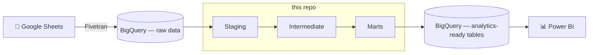

# 🧱 personal_finances_dbt

The **dbt transformation layer** behind *Personal Finances Analytics* — a portfolio project that turns raw, manually-logged financial data into clean, analysis-ready tables in BigQuery.

> 📊 **Looking for the full picture?** The project story, dashboards, and budgeting framework live in the main [`personal_finances`](https://github.com/clayamakita/personal_finances) repo. This repo is just the SQL/data modeling piece.

## What is dbt, and what does it do here?

dbt (data build tool) is what takes raw data sitting in a warehouse and turns it into trustworthy, ready-to-use tables. In practice, it's a collection of SQL files, each one a "model," that build on top of each other in a defined order. Every model is version-controlled, documented, and automatically tested, so it's easy to trace exactly how a number in a dashboard was calculated and to catch mistakes before they reach a report.

In this project, dbt is the step that takes messy transaction and investment data and turns it into the tables a dashboard can actually use.

## Where this fits in the pipeline



## 👀 Browse the SQL

This is the fastest way to see how the models are built:

| Layer | What it does | Where to look |
|---|---|---|
| **Staging** | 1:1 with the raw source tables — light cleaning, renaming, type casting | [`models/staging`](https://github.com/clayamakita/personal_finances_dbt/tree/main/models/staging) |
| **Intermediate** | Joins and aggregations that implement business logic | [`models/intermediate`](https://github.com/clayamakita/personal_finances_dbt/tree/main/models/intermediate) |
| **Marts** | Final dimension and fact tables, ready for BI | [`models/marts`](https://github.com/clayamakita/personal_finances_dbt/tree/main/models/marts) |
| **Macros** | Reusable SQL/Jinja logic, incl. a macro that recalculates annualized investment returns on every run | [`macros`](https://github.com/clayamakita/personal_finances_dbt/tree/main/macros) |

<details>
<summary>dbt DAG (click to expand)</summary>


</details>


## 📁 Project structure

```
models/
├── staging/        # clean & standardize raw source tables (materialized as views)
├── intermediate/   # join & aggregate staging models (materialized as views)
└── marts/          # dimension & fact tables (materialized as tables)
macros/             # reusable SQL logic, e.g. annualized return calculation
seeds/              # static reference data loaded from CSVs (not used yet)
snapshots/          # tracks how records change over time (not used yet)
tests/              # custom data quality tests (not used yet)
analyses/           # ad-hoc SQL, not built into the warehouse (not used yet)
```

## Data quality

Every model is tested for primary-key uniqueness, null checks, and relationship integrity between tables, so broken joins or duplicate records get caught before they hit a dashboard.

---

Built by [Clarissa Yamakita](https://github.com/clayamakita) as part of a portfolio project. See [`personal_finances`](https://github.com/clayamakita/personal_finances) for the full write-up, dashboards, and live report link.